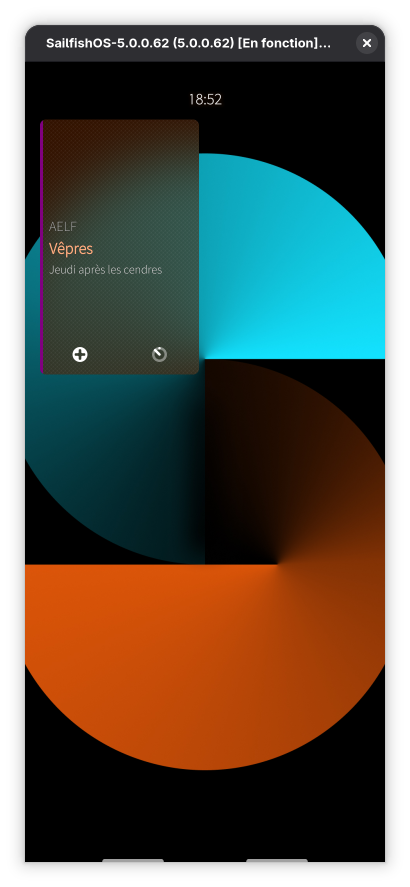
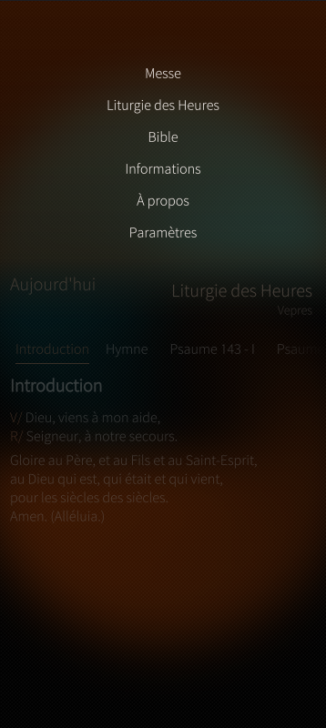
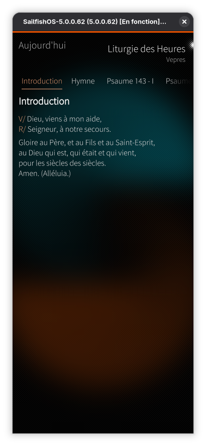
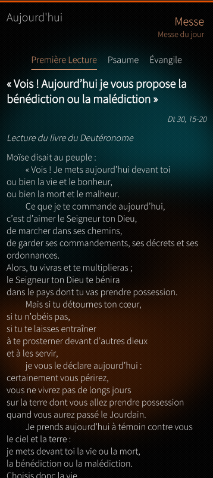
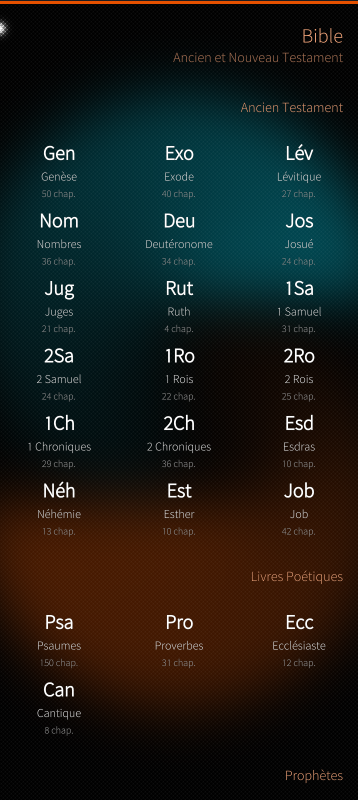
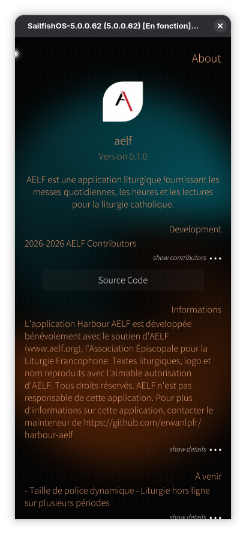

# AELF - Harbour

**Une application native pour Sailfish OS (Harbour) proposant le contenu liturgique catholique d'AELF.org, incluant la Bible et les lectures quotidiennes.**

> 🇫🇷 Cette application est uniquement disponible en français car elle s'adresse principalement à la communauté catholique francophone.

> 🇬🇧 This application is only available in French because it is primarily intended for the French-speaking Catholic community.

## 🔹 Fonctionnalités

- **Messe quotidienne** : Lectures et prières complètes pour les messes quotidiennes.
- **Liturgie des Heures** : Prières du matin, du soir et de la nuit.
- **Bible** : Bible complète en français accessible hors ligne.
- **Calendrier** : Calendrier liturgique avec les fêtes.
- **Régional** : Prise en charge des différentes zones liturgiques.
- **Taille de police dynamique** : Ajustez la taille du texte via les paramètres ou par geste de pincement.

## 📸 Captures d'écran

<div align="center">
  <table>
    <tr>
      <td align="center"><br>Page de couverture</td>
      <td align="center"><br>Menu déroulant</td>
      <td align="center"><br>Sélection de date</td>
      <td align="center"><br>Liturgie des Heures</td>
    </tr>
    <tr>
      <td align="center"><br>Messe du jour</td>
      <td align="center"><br>Bible</td>
      <td align="center"><br>À propos</td>
    </tr>
  </table>
</div>

## 📋 Liste des projets

- ~~**Taille de police dynamique**~~ ✅ (v1.1.0)
- **Sélection du texte** : Pouvoir sélectionner et copier du texte.
- **Naviguer à la référence**: Pouvoir naviguer par référence depuis les lectures.
- **Liturgie hors ligne sur plusieurs périodes** : Télécharger et stocker les textes liturgiques pour plusieurs jours afin de permettre une consultation hors ligne étendue.
- **Favoris pour la Bible** : Sauvegarder des versets ou passages bibliques en favoris pour y accéder rapidement.

## 📜 Héritage du code

Cette application Sailfish OS s'inspire du projet **[aelf-flutter](https://gitlab.com/nathanael2/aelf-flutter)** (sous **GPLv3**), qui est le code original et l'idée d'origine.

## ⚖️ Licence

Ce projet est distribué sous **[GNU GPLv3](https://www.gnu.org/licenses/gpl-3.0.html)**.

- **Code source d'inspiration** : [aelf-flutter](https://gitlab.com/nathanael2/aelf-flutter) (GPLv3).
- **Auteur de cette version** : 2026 erwanlpfr.

## 📦 Dépendances

- **Qt 5.6+** (sous **LGPLv3**) : Utilisé pour l'interface et la logique applicative.
  Voir [LICENSE.QT](LICENSE.QT) pour les détails de la licence.

## 🛠️ Compilation

### Prérequis

- [Sailfish SDK](https://docs.sailfishos.org/Tools/Sailfish_SDK/) (sfdk)
- Qt 5.6+ (Core, Qml, Quick, Sql, Concurrent)
- Sailfish Silica >= 0.10.9

### Configuration et compilation

```bash
# Configurer la cible de build
sfdk config target=SailfishOS-5.0.0.62-aarch64

# Compilation complète
sfdk build

# Étapes individuelles
sfdk qmake .
sfdk make
sfdk package
```

### Déploiement

```bash
# Déployer sur l'appareil
sfdk deploy --sdk
```

### Vérification

```bash
# Valider le paquet RPM
sfdk check
```

## 🤝 Contribution

Les contributions sont les bienvenues ! Consultez [CONTRIBUTING.md](CONTRIBUTING.md) pour les directives de développement. Vous pouvez soumettre des *pull requests* ou ouvrir des *issues* pour signaler des bugs, proposer des fonctionnalités ou des traductions.

## ❓ Problèmes, suggestions

Si vous rencontrez un bug dans l'application AELF, vous pouvez le signaler ici en ouvrant une *issue*. Consultez également la liste des *issues* existantes.

## 🙏 Remerciements

- **AELF.org** pour le contenu liturgique.
- **Le projet OPAL** pour les composants d'interface utilisateur.
- **La communauté Sailfish OS**.
- **Nathanael** (auteur de [aelf-flutter](https://gitlab.com/nathanael2/aelf-flutter)) pour l'idée originale et l'inspiration.
